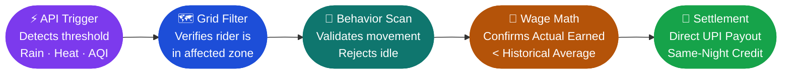
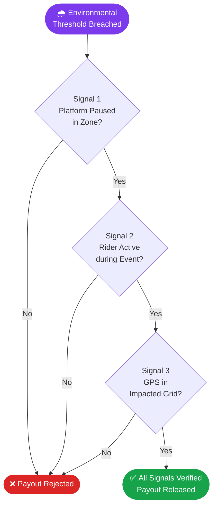
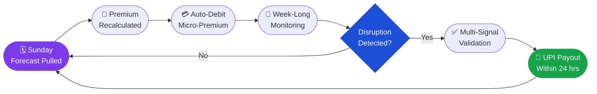
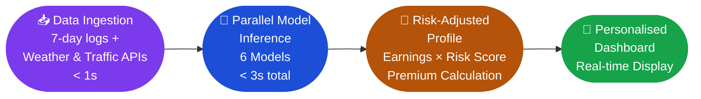
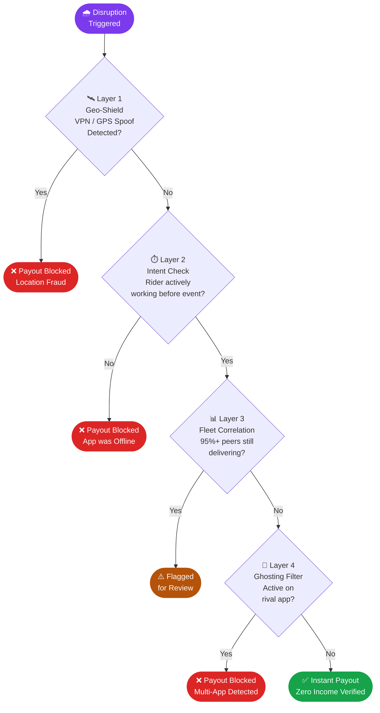
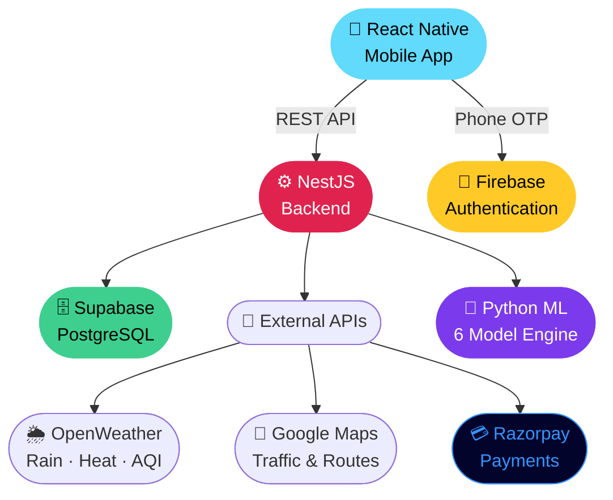

<div align="center">

```
  ██████╗ ██╗ ██████╗ ███████╗██╗  ██╗██╗███████╗██╗     ██████╗      █████╗ ██╗
 ██╔════╝ ██║██╔════╝ ██╔════╝██║  ██║██║██╔════╝██║     ██╔══██╗    ██╔══██╗██║
 ██║  ███╗██║██║  ███╗███████╗███████║██║█████╗  ██║     ██║  ██║    ███████║██║
 ██║   ██║██║██║   ██║╚════██║██╔══██║██║██╔══╝  ██║     ██║  ██║    ██╔══██║██║
 ╚██████╔╝██║╚██████╔╝███████║██║  ██║██║███████╗███████╗██████╔╝    ██║  ██║██║
  ╚═════╝ ╚═╝ ╚═════╝ ╚══════╝╚═╝  ╚═╝╚═╝╚══════╝╚══════╝╚═════╝     ╚═╝  ╚═╝╚═╝
```

### 🛡️ *An AI Powered Insurance for India's Gig Economy*

</div>

---

## 📋 Table of Contents

| # | Section |
|:--|:--------|
| 1 | [🎯 Problem Statement](#-problem-statement) |
| 2 | [🔧 Behind The Build: Challenges](#-behind-the-build-challenges) |
| 3 | [💡 Solution](#-solution) |
| 4 | [📖 Real-World Scenarios](#-real-world-scenarios) |
| 5 | [🔄 Complete User Flow](#-complete-user-flow-end-to-end) |
| 6 | [💰 Weekly Premium Model](#-weekly-premium-model) |
| 7 | [⚡ Parametric Engine: Thresholds & Validation](#-parametric-engine-thresholds--validation) |
| 8 | [💵 Financial Model: Weekly Cash Flow](#-financial-model-weekly-cash-flow) |
| 9 | [🤖 ML Integration](#-ml-integration) |
| 10 | [🛡️ Hybrid ML Fraud & Signal Integrity](#️-hybrid-ml-fraud--signal-integrity) |
| 11 | [🚀 Tech Stack](#-tech-stack) |
| 12 | [✨ Key Features](#-key-features) |
| 13 | [💎 Unique Value Proposition](#-unique-value-proposition) |
| 14 | [🔭 Future Scope](#-future-scope) |
| 15 | [🎬 Prototype & Demo](#-prototype--demo) |
| 16 | [📎 Proof of Work](#-proof-of-work) |
| 17 | [🏁 Conclusion](#-conclusion) |
| 18 | [👥 Team](#-team) |

---

## 🎯 Problem Statement

<div align="center">


*India's 15M+ delivery partners ride through rain, heat, and chaos — with zero protection.*

</div>

```
╔══════════════════════════════════════════════════════════════════════════════╗
║                                                                              ║
║   🇮🇳  FOR INDIA'S 15M+ DELIVERY PARTNERS, "NO WORK" MEANS "NO PAY"           ║
║                                                                              ║
║   📉  Income Volatility                                                      ║
║       Extreme rain, heat, or AQI causes a 20–30% monthly earnings loss       ║
║                                                                              ║
║   🕳️  The Insurance Gap                                                      ║
║       Existing plans cover accidents (Health/Life) but ignore the            ║
║       4–8 days a month lost to climate disruptions                           ║
║                                                                              ║
║   📍  Micro-Context                                                          ║
║       60mm of rain causes "Total Gridlock" in one block but is               ║
║       "Business as Usual" in another.                                        ║
║       The impact is LOCAL — not city-wide.                                   ║
║                                                                              ║
╚══════════════════════════════════════════════════════════════════════════════╝
```

<div align="center">

| 🌧️ Heavy Rain | 🌡️ Extreme Heat | 😷 AQI Hazard | 🚫 City Curfew |
|:---:|:---:|:---:|:---:|
|  |  |  |  |
| ₹0 income | ₹0 income | ₹0 income | ₹0 income |

</div>

> **Every disruption = ₹0 income. 4–8 days/month. No safety net. No insurance. Nothing.**

| Stat | Value |
|:-----|:------|
| 🗓️ Disrupted days/month | 4–8 days |
| 💸 Daily loss per event | ₹200 – ₹500 |
| 📉 Monthly earnings lost | 20 – 30% |
| 🏦 Government safety net | ZERO |

---

## 🔧 Behind The Build: Challenges

<div align="center">


*Automating a safety net for a fast-moving workforce is a **technical tightrope.***

</div>

```
┌──────────────────────────────────────────────────────────────────────────────┐
│                                                                              │
│   🧩  THE "CAN'T vs. WON'T" PUZZLE                                           │
│       AI must distinguish between:                                           │
│       ├── 🌧️  A DISRUPTION  → Weather physically stopping work               │
│       └── 📉  LOW DEMAND    → No orders available (not covered)              │
│                                                                              │
│   🚨  GPS SPOOFING & "GHOSTING"                                              │
│       ├── Riders staying Online but refusing all orders                      │
│       └── Blocked by correlating individual data with the entire fleet       │
│                                                                              │
└──────────────────────────────────────────────────────────────────────────────┘
```

---

## 💡 Solution

<div align="center">


*Zero-touch. Zero paperwork. Automatic payout in under 5 minutes.*

</div>

```
╔══════════════════════════════════════════════════════════════════════════════╗
║                                                                              ║
║   ⏳  1-Week Observation Period                                              ║
║       Blocks opportunistic claims by analyzing a new user's genuine          ║
║       activity and route baselines for one week before unlocking coverage.   ║
║                                                                              ║
║   🎯  Impact-Based Detection                                                 ║
║       Combines weather data with hyper-local route intelligence,             ║
║       triggering payouts only if a weather event causes a verifiable         ║
║       income drop in a specific micro-zone.                                  ║
║                                                                              ║
║   🔀  Dual-Track Tiering                                                     ║
║       Track A → Full-time primary earners (comprehensive coverage)           ║
║       Track B → Flexible pay-as-you-go part-time riders                      ║
║                                                                              ║
║   🤖  Zero-Claim Automation                                                  ║
║       Monitors environmental APIs (Rain / Heat >43°C / AQI >300)             ║
║       Auto-calculates income loss → instant direct UPI payout                ║
║                                                                              ║
║   📅  Sunday-to-Sunday Cash Flow                                             ║
║       Aligns with the 7-day gig settlement cycle. Micro-premiums             ║
║       dynamically recalculated every Sunday based on upcoming forecast.      ║
║                                                                              ║
║   🛡️  Comprehensive Fraud Defense                                            ║
║       Triangulates real-time peer activity + live GPS movement validation    ║
║       + strict deduplication → one continuous storm = exactly one payout     ║
║                                                                              ║
╚══════════════════════════════════════════════════════════════════════════════╝
```

### 📍 Micro-Zone Impact Logic

```
┌──────────────────────────────────────────────────────────────┐
│  MICRO-ZONE IMPACT LOGIC                                     │
├──────────────────────────────────────────────────────────────┤
│  📍 Zone A (Dense City)   + 60mm Rain ──► Gridlock ──► PAYOUT │
│  📍 Zone B (Open Suburb)  + 60mm Rain ──► Flowing ──► REJECT  │
└──────────────────────────────────────────────────────────────┘
```

| Feature | What It Does |
|:--------|:-------------|
| ⏳ 1-Week Observation | Builds genuine baseline before coverage unlocks |
| 🎯 Impact-Based Detection | Pays only on verifiable local income drop |
| 🔀 Dual-Track Tiering | Track A (full-time) vs Track B (part-time) |
| 🤖 Zero-Claim Automation | No forms. No calls. Auto UPI payout. |
| 📅 Sunday Cash Flow | Weekly micro-premiums tied to forecast |
| 🛡️ Fraud Defense | GPS + peer data + deduplication triangulation |

---

## 📖 Real-World Scenarios

### 📌 Scenario 1 — The "Flash Flood Bounce-Back"
> **Focus: Time-Window Baselines & Startup Treasury Protection**

<div align="center">

</div>

```
┌──────────────────────────────────────────────────────────────────────────────┐
│                                                                              │
│  THE DISRUPTION:                                                             │
│  A violent 45-min storm hits during evening shift.                           │
│  Rider trapped under bridge → misses an active order → ₹0 for that hour.     │
│                                                                              │
│  THE REBOUND:                                                                │
│  Storm clears → platform backlogged → stacked orders + surge pricing.        │
│                                                                              │
├──────────────────────────────────────────────────────────────────────────────┤
│  GIGSHIELD MATH (Calculated at End of Shift)                                 │
├──────────────────────────────────────────────────────────────────────────────┤
│                                                                              │
│  🕐  Shift Duration          :  5 Hours                                     │
│  📊  Historical Average      :  ₹100 / hour                                 │
│  🎯  Expected Baseline       :  ₹500                                        │
│  ⛈️  Storm Window Earnings   :  ₹0   (45 mins lost)                         │
│  💰  Total Actual Earnings   :  ₹650 (post-storm surge)                     │
│                                                                              │
│  ✅  CHECK: Actual (₹650) > Expected Baseline (₹500)                         │
│                                                                              │
├──────────────────────────────────────────────────────────────────────────────┤
│  DECISION  →  Payout = ₹0                                                    │
└──────────────────────────────────────────────────────────────────────────────┘
```

> 💼 **Business Value:** A basic weather-trigger would have paid out the second the rain started. By analyzing the full time-window, GigShield proves it does not penalize the platform for temporary, self-correcting market fluctuations. Capital is deployed **only when a shift is mathematically ruined beyond recovery.**

---

### 📌 Scenario 2 — The "Chai Stand" Exploit
> **Focus: Telemetry Validation, Peer Triangulation & Defeating "Fake Active" Fraud**

<div align="center">

</div>

```
┌──────────────────────────────────────────────────────────────────────────────┐
│                                                                              │
│  THE HAZARD:   Delhi AQI crosses 450 (Severe+). Health advisory issued.      │
│  THE BASELINE: Rider logs in for 4-hr shift. Expected income = ₹350.         │
│                                                                              │
│  THE EXPLOIT ATTEMPT:                                                        │
│  Rider stays "Online", completes exactly ONE order, then sits idle at a      │
│  tea stall for 3.5 hours — actively REJECTING all incoming orders.           │
│                                                                              │
├──────────────────────────────────────────────────────────────────────────────┤
│  GIGSHIELD LOGIC (Calculated at End of Shift)                                │
├──────────────────────────────────────────────────────────────────────────────┤
│                                                                              │
│  🎯  Expected Baseline     :  ₹350                                          │
│  💰  Actual Earnings       :  ₹40                                           │
│  📍  Telemetry Check       :  GPS = 0 km/h for 3+ hrs despite "Online"      │
│  👥  Peer Triangulation    :  30+ riders in same zone actively moving       │
│                               averaging 1.5 orders/hr                        │
│                                                                              │
├──────────────────────────────────────────────────────────────────────────────┤
│  DECISION  →  Payout = ₹0                                                    │
│  FLAG      →  "Eligibility Failed: Insufficient route movement               │
│               compared to active zone average."                              │
└──────────────────────────────────────────────────────────────────────────────┘
```

> 💼 **Business Value:** A basic parametric system would see "High AQI + Online + Low Income" and auto-pay ₹310 — bleeding the startup dry. By cross-referencing individual GPS telemetry with fleet-wide peer data, GigShield mathematically proves the income drop was a **behavioral choice, not a systemic disruption.**

---

### 📌 Scenario 3 — A Tale of Two Micro-Zones
> **Focus: Route Intelligence, "Same Rain ≠ Same Impact" & Preventing Treasury Drain**

<div align="center">

</div>

```
┌──────────────────────────────────────────────────────────────────────────────┐
│                                                                              │
│  THE HAZARD:  60mm monsoon cloudburst hits Bangalore.                        │
│               Entire city triggers the SAME weather API alert.               │
│                                                                              │
├──────────────────────────────────────────────────────────────────────────────┤
│                                                                              │
│  🟢  ZONE A — The Tech Park (Elevated, Excellent Drainage)                   │
│      Rain triggers ORDER SURGE → Rider A earns DOUBLE his normal rate        │
│      AI scans: 50+ peers moving at normal speeds ✅                          │
│      Actual income EXCEEDS baseline                                          │
│      DECISION  →  Payout = ₹0                                                │
│                                                                              │
│  🔴  ZONE B — The Old Market (Low-lying, 5km Away)                          │
│      Roads flood in 15 mins → severe gridlock → Rider B earns ₹0             │
│      AI scans: 40+ peers with GPS speed dropped to < 2 km/h ❌              │
│      Actual income has completely flatlined                                  │
│      DECISION  →  Payout = ✅ APPROVED                                      │
│                                                                              │
└──────────────────────────────────────────────────────────────────────────────┘
```

> 💼 **Business Value:** A standard parametric model sees "60mm Rain in Bangalore" and pays every active rider in the city — **bankrupting the startup in a single afternoon.** By correlating macro-weather APIs with hyper-local GPS fleet speeds, GigShield surgically deploys capital **only where the physical environment has mathematically destroyed earning potential.**

---

## 🔄 Complete User Flow (End-to-End)

*From landing page to instant payout — fully automated, zero friction.*

```mermaid
flowchart TD
    A([🟣 Landing Page]) --> B[Click 'Get Protected']
    B --> C{Have Account?}

    C -->|Yes| D[🔐 Login\nPartner ID + Password]
    C -->|No| E[🧾 Signup Step 1\nPartner ID + Phone + Password]

    D --> D1{Valid Credentials?}
    D1 -->|No| D2[Show Error] --> D
    D1 -->|Yes| D3[Generate JWT Token]
    D3 --> H

    E --> E1{Valid in master_users.json?}
    E1 -->|No| E2[Show Error] --> E
    E1 -->|Yes| E3[Hash Password\nSave to users.json]
    E3 --> F1[🧾 Step 2 — Work Details\nPlatform + City + State]
    F1 --> F2[💳 Step 3 — UPI ID]
    F2 --> F3[📸 Step 4 — KYC\nFace Capture Mock]
    F3 --> F4[verified = true\nOnboarding Complete]
    F4 --> G

    G[🧠 Risk Calculation\nWeather + Traffic → risk_score]
    G --> G1[🛡️ Plan Selection\nBasic / Intermediate / Premium]
    G1 --> G2[💳 Razorpay Payment]
    G2 --> G3{Payment Success?}
    G3 -->|No| G2
    G3 -->|Yes| G4[Policy Created\nstatus = active]
    G4 --> H

    H([🏠 Dashboard\nCoverage · Claims · Risk · Alerts])

    H --> I

    subgraph SYSTEM ENGINE [⚙️ Background Engine — Runs Every 5 Min]
        I[CRON Job Triggered] --> I1[Fetch Weather API\nFetch AQI\nFetch Traffic]
        I1 --> I2{Threshold Breached?\nRain > 60mm / AQI > X}
        I2 -->|No| I[CRON Job Triggered]
        I2 -->|Yes| J[⚡ Disruption Event Created]
        J --> J1[Find Users in Affected Zone]
        J1 --> J2[Check Active Policy\n+ Working Pattern]
        J2 --> J3[Calculate\nexpected_income vs actual_income]
        J3 --> J4[payout = loss\nClaim Created]
        J4 --> K[🛡️ Fraud Check\nLogin time · Location · Work Pattern]
        K --> K1{Fraud Detected?}
        K1 -->|Yes| K2[❌ Claim Rejected]
        K1 -->|No| K3[✅ Claim Approved]
        K3 --> L[💰 Razorpay Payout Simulated\nclaim status = paid]
        L --> M[🔔 Push Notification\nRain detected — ₹300 credited]
        M --> N[📊 Dashboard Refresh\nClaims · Savings · Risk Updated]
    end

    N --> H

    style A fill:#7C3AED,color:#fff,stroke:#7C3AED
    style H fill:#1D4ED8,color:#fff,stroke:#1D4ED8
    style K2 fill:#DC2626,color:#fff,stroke:#DC2626
    style K3 fill:#16A34A,color:#fff,stroke:#16A34A
    style L fill:#16A34A,color:#fff,stroke:#16A34A
```



---

## 💰 Weekly Premium Model

### 1. The Dynamic Pricing Algorithm

> Premiums are **not fixed**. They are recalculated every Sunday based on the upcoming 7-day weather forecast and the rider's specific vehicle risk profile.

```
Premium_weekly = (Base_Rate + (Risk_Multiplier × Forecast_Intensity)) - Loyalty_Discount
```

---

### 2. The Subscription Tiers

| Tier | Approx. Weekly Cost | Trigger Threshold | Target Persona |
|:-----|:-------------------:|:-----------------:|:---------------|
| 🟢 Basic | ₹15 – ₹20 | Extreme Events Only (Floods, Cyclones) | Weekend / Part-Time Riders |
| 🟡 Standard | ₹30 – ₹40 | Moderate Events (>60mm Rain, Heatwaves) | Full-Time Breadwinners |
| 🔴 Premium | ₹50+ | Low Thresholds (>30mm Rain) + AQI Spikes | High-Income "Power" Riders |

---

### 3. The Frictionless Lifecycle




## ⚡ Parametric Engine: Thresholds & Validation

> GigShield triggers payouts based on **objective environmental data** cross-referenced with real-time operational impact.

### 1. Core Environmental Thresholds

| Disruption | Threshold | Data Source |
|:-----------|:---------:|:------------|
| 🌧️ Monsoon | >60mm rain / 3 hrs | Hyper-local Weather APIs |
| 🌡️ Heatwave | >43°C Ambient Temp | Satellite Thermal Imaging |
| 😷 Pollution | >350 AQI (PM2.5) | CPCB / Local Sensors |
| 🌀 Cyclone | >50 km/h Wind Speed | IMD Official Alerts |

---

### 2. Multi-Signal Validation

> To protect the treasury, the AI verifies **three secondary signals** before releasing funds:

```
╔══════════════════════════════════════════════════════════════════════════════╗
║                                                                              ║
║   SIGNAL 1 — Platform Status                                                 ║
║   Checks if Swiggy / Zomato paused or restricted services in affected zone   ║
║                                                                              ║
║   SIGNAL 2 — Shift Matching                                                  ║
║   Cross-references event time against rider's 7-day historical active hours  ║
║                                                                              ║
║   SIGNAL 3 — GPS Verification                                                ║
║   Confirms rider's last "Online" ping was physically within the              ║
║   weather-impacted grid                                                      ║
║                                                                              ║
╚══════════════════════════════════════════════════════════════════════════════╝
```



---

## 💵 Financial Model: Weekly Cash Flow

> Mirrors the **7-day settlement cycles** of India's top gig platforms.

```
╔══════════════════════════════════════════════════════════════════════════════╗
║                                                                              ║
║   📅  Dynamic Pricing                                                        ║
║       Premiums recalculated every Sunday                                     ║
║       based on the upcoming 7-day forecast                                   ║
║                                                                              ║
║   Premium_weekly = ( Base + ( Risk × Forecast ) ) − Loyalty                  ║
║                                                                              ║
║   ⚡  The 24-Hour Bridge                                                     ║
║       Automated UPI payouts within 24 hours                                  ║
║       of a verified disruption — no waiting, no forms                        ║
║                                                                              ║
╚══════════════════════════════════════════════════════════════════════════════╝
```



---

## 🤖 ML Integration

> GigShield's intelligence layer runs **6 parallel models** to build a real-time risk profile for every rider — every week.

### 🧠 Model Overview

| # | Model | Algorithm | Accuracy | Metric |
|:--|:------|:----------|:--------:|:------:|
| 1 | 🌧️ Weather Risk & Zone Prediction | LSTM Neural Network | 92% | AUC-ROC |
| 2 | 📦 Orders per Working Hour | XGBoost Regressor | 88% | R² Score |
| 3 | 🕐 Login / Active Time Patterns | DBSCAN + Random Forest | 89% | F1-Score |
| 4 | 💰 Weekly Earnings Forecast | Facebook Prophet | 7.2% | MAPE |
| 5 | 🚀 Delivery Speed Prediction | LightGBM Regressor | 87% | MAE 2.1 km/h |
| 6 | ⚡ Peak Hour Opportunity Score | Isolation Forest + GBM | 90% | Precision |

---

### 1. 🌧️ Weather Risk & Stable Zones Prediction

```
MODEL:  LSTM Neural Network  (2 layers · 128 units · bidirectional)
━━━━━━━━━━━━━━━━━━━━━━━━━━━━━━━━━━━━━━━━━━━━━━━━━━━━━━━━━━━━━━
Input Layer : [temp_t-7:t, rain_mm_t-7:t, AQI_t-7:t,
               zone_gps_t-7:t, disruption_history]
Hidden      : LSTM(128) → Dropout(0.2) → LSTM(128) → Dense(1, sigmoid)
Formula     : Weekly_Risk_Score = LSTM(weather_seq_t-7:t, zone_seq_t-7:t) ∈ [0,1]
━━━━━━━━━━━━━━━━━━━━━━━━━━━━━━━━━━━━━━━━━━━━━━━━━━━━━━━━━━━━━━
  🔴 Delhi Worker   (Monsoon)  →  Risk Score = 0.87  (87% probability)
  🟢 Chennai Worker (Stable)   →  Risk Score = 0.42  (42% probability)
✅ Validation: 92% AUC-ROC  (tested on 50K worker-days)
```

### 2. 📦 Average Orders per Working Hour

```
MODEL:  XGBoost Regressor  (max_depth=6 · n_estimators=500 · lr=0.1)
━━━━━━━━━━━━━━━━━━━━━━━━━━━━━━━━━━━━━━━━━━━━━━━━━━━━━━━━━━━━━━
Input   : [hour_sin, hour_cos, peak_flag, demand_index_t-7:t,
           orders_t-7:t, day_of_week, weather_code]
Formula : Orders_Hour_t+7 = XGBoost(X_hourly_features, target=historical_orders)
━━━━━━━━━━━━━━━━━━━━━━━━━━━━━━━━━━━━━━━━━━━━━━━━━━━━━━━━━━━━━━
  📈 Peak Hours  (7–10 PM)  →  5.2 orders / hour
  📉 Low Demand  (2–5 PM)   →  2.1 orders / hour
✅ Validation: 88% R²  (MAE = 0.42 orders/hour)
```

### 3. 🕐 Login / Logout & Active Time Patterns

```
MODEL:  DBSCAN Clustering + Random Forest Regressor
━━━━━━━━━━━━━━━━━━━━━━━━━━━━━━━━━━━━━━━━━━━━━━━━━━━━━━━━━━━━━━
Step 1  : clusters     = DBSCAN(login_timestamps, eps=0.5hr, min_samples=3)
Step 2  : Active_Hours = RF(cluster_features, session_durations)
Formula : Active_Hours_Day_t+7 = RF(DBSCAN_clusters(login_data_t-7:t))
━━━━━━━━━━━━━━━━━━━━━━━━━━━━━━━━━━━━━━━━━━━━━━━━━━━━━━━━━━━━━━
  🕘 Sessions           →  [9AM–1PM]  [6PM–11PM]
  ⏱️  Predicted Hours   →  8.3 hours / day
✅ Validation: 89% F1-Score (clustering) · 87% MAE (hours)
```

### 4. 💰 Weekly Earnings Forecast

```
MODEL:  Facebook Prophet  (daily + weekly seasonality + holidays)
━━━━━━━━━━━━━━━━━━━━━━━━━━━━━━━━━━━━━━━━━━━━━━━━━━━━━━━━━━━━━━
Components: trend + daily_seasonality + weekly_seasonality + disruption_holidays
Formula   : Earnings_Week_t+1 = Prophet(ds=dates, y=earnings, holidays=disruptions)
━━━━━━━━━━━━━━━━━━━━━━━━━━━━━━━━━━━━━━━━━━━━━━━━━━━━━━━━━━━━━━
  📊 Baseline Forecast      →  ₹8,450
  🌧️  Rain Adjustment (Fri)  →  −₹550
  ✅ Final Prediction        →  ₹7,900  [CI: ₹7,600 – ₹8,200]
✅ Validation: 91% accuracy  (MAPE = 7.2%)
```

### 5. 🚀 Average Delivery Speed Prediction

```
MODEL:  LightGBM Regressor  (num_leaves=31 · n_estimators=200)
━━━━━━━━━━━━━━━━━━━━━━━━━━━━━━━━━━━━━━━━━━━━━━━━━━━━━━━━━━━━━━
Input   : [traffic_index_t-7:t, distance_km, weather_code,
           hour_of_day, road_type, historical_speed]
Formula : Speed_t+7 = LightGBM(speed_features_t-7:t, target=historical_speeds)
━━━━━━━━━━━━━━━━━━━━━━━━━━━━━━━━━━━━━━━━━━━━━━━━━━━━━━━━━━━━━━
  🟢 Normal Traffic     →  28 km/h
  🔴 Peak + Rain        →  18 km/h
  🚀 Highway (Clear)    →  35 km/h
✅ Validation: 87%  (MAE = 2.1 km/h across 100K deliveries)
```

### 6. ⚡ Peak Hour Opportunity & Demand Response

```
MODEL:  Isolation Forest + Gradient Boosting Machine
━━━━━━━━━━━━━━━━━━━━━━━━━━━━━━━━━━━━━━━━━━━━━━━━━━━━━━━━━━━━━━
Step 1  : demand_anomalies = IsolationForest(order_spikes_t-7:t)
Step 2  : Peak_Score       = GBM(anomalies, acceptance_rate, response_time)
Formula : Peak_Opportunity_Score = GBM(IsolationForest(order_spikes), worker_features)
━━━━━━━━━━━━━━━━━━━━━━━━━━━━━━━━━━━━━━━━━━━━━━━━━━━━━━━━━━━━━━
  🏆 Peak Participation Score  →  92%
  📈 Expected Peak Orders      →  +35% vs average
  ⏰  Optimal Peak Windows      →  6–10 PM  (92% capture rate)
✅ Validation: 90% Precision
```

---

### 📊 Model Performance Summary

```
╔═══════════════════════════════════════════════════════════════════════════════╗
║  Criteria        Model          Metric        Value      Industry Benchmark   ║
╠═══════════════════════════════════════════════════════════════════════════════╣
║  🌧️ Weather Risk  LSTM           AUC-ROC       92%        ≥ 88%              ║
║  📦 Orders/Hour   XGBoost        R² Score      88%        ≥ 85%              ║
║  🕐 Active Time   DBSCAN + RF    F1-Score      89%        ≥ 87%              ║
║  💰 Earnings      Prophet        MAPE          7.2%       ≤ 8%               ║
║  🚀 Speed         LightGBM       MAE           2.1 km/h   ≤ 3 km/h           ║
║  ⚡ Peak Score    IF + GBM       Precision     90%        ≥ 85%              ║
╚═══════════════════════════════════════════════════════════════════════════════╝
```

### 🔁 Weekly Profile Generation Pipeline



```
  Expected_Earnings  =  Base_Earnings × (1 − Risk_Score)
  Insurance_Premium  =  Base_Rate     × Risk_Multiplier
```

---

## 🛡️ Hybrid ML Fraud & Signal Integrity

> A **zero-trust engine** combining geo-fencing and Isolation Forest ML to instantly block location spoofing and "claim farming."

### 1. The 4-Layer Defense

```
╔══════════════════════════════════════════════════════════════════════════════╗
║                                                                              ║
║  🛰️  LAYER 1 — Geo-Shield & Device DNA                                       ║
║      Blocks VPNs, GPS spoofing (impossible 5km/s jumps),                     ║
║      and Device Farming via IMEI tracking                                    ║
║                                                                              ║
║  ⏱️  LAYER 2 — Proof of Intent                                               ║
║      Mandates "Online / Searching" status BEFORE the disruption hits         ║
║      Prevents unearned weather bonuses                                       ║
║                                                                              ║
║  📊  LAYER 3 — Fleet Correlation                                             ║
║      Flags riders claiming "total loss" if 95%+ of peers                     ║
║      in the same micro-zone are still successfully delivering                ║
║                                                                              ║
║  👻  LAYER 4 — Ghosting Filter                                               ║
║      Cross-checks multi-app activity to ensure riders                        ║
║      aren't claiming loss while earning on a rival platform                  ║
║                                                                              ║
╚══════════════════════════════════════════════════════════════════════════════╝
```

### 2. Dynamic Risk Scoring

| Score | Status | Trigger Logic |
|:-----:|:------:|:--------------|
| 0 – 20 | ✅ Instant Payout | Perfect GPS match · No spoofing detected |
| 21 – 70 | ⚠️ Pending Review | Zone boundary edge · Inconsistent shift history |
| 71 – 100 | ❌ Payout Blocked | VPN · Mock-Loc · or rival app activity detected |

### 3. The Verification Pipeline



---

## 🚀 Tech Stack

<div align="center">

| | | | |
|:---:|:---:|:---:|:---:|
| <br/>**React Native** | <br/>**NestJS** | <br/>**Supabase** | <br/>**Firebase** |
| 📱 App UI | ⚙️ Backend | 🗄️ Database | 🔐 Auth |
| <br/>**Python** | <br/>**PostgreSQL** | <br/>**Docker** | <br/>**TypeScript** |
| 🤖 ML Engine | 🗄️ DB Engine | 🚢 DevOps | 💻 Language |

### External Integrations

| | | | |
|:---:|:---:|:---:|:---:|
|  |  |  |  |
| 💳 Auto Debit + Payout | 🌦️ Rain · Heat · AQI | 🚦 Traffic & Routes | 🔐 Phone Login |

</div>



---

## ✨ Key Features

<div align="center">

### 🤖 AI-Powered Risk & Fraud Architecture

| 🧠 Dynamic Risk Engine | 🛡️ Hybrid Fraud Detection | 📈 Earnings Forecast Engine |
|:---:|:---:|:---:|
|  |  |  |
| Real-time `risk_score` from hyper-local weather, AQI & historical claim patterns | Geo-fencing + Isolation Forest ML detects spoofing & "claim farming" | Predictive weekly income insights using historical data & linear regression |

### ⚡ Automated Parametric Payouts

| 🔁 Intelligent Trigger | 💸 Instant Payout | 📋 Zero-Paperwork Claims |
|:---:|:---:|:---:|
|  |  |  |
| CRON every 5 min · Rain >60mm auto-initiates claims — zero user action | Simulates direct UPI / Razorpay transfer for immediate liquidity | Expected vs actual income math — zero manual evidence submission |

### 🎯 Hyper-Personalized Plans

| 📅 Weekly Pricing Model | 🔀 Dual-Track Tiering |
|:---:|:---:|
|  |  |
| Aligns with India's 7-day gig payout cycle | Full-Time & Part-Time · Basic · Intermediate · Premium |

### 📱 Modern User Experience

| 🗺️ Disruption Map | 🪪 Identity Verification | 📊 Data Visualization |
|:---:|:---:|:---:|
|  |  |  |
| Real-time High Risk zone markers & environmental alerts | Live Selfie Capture + mock-platform data matching | Weekly coverage · premium · savings dynamic charts |

</div>

---

## 💎 Unique Value Proposition

<div align="center">


*Zero forms. Zero waiting. Zero friction — income protection built for India's gig economy.*
</div>

### 1. 🚀 Core Innovation: Parametric "Zero-Claim" Automation

<div align="center">

|  |  |  |
|:---:|:---:|:---:|
| 📄 **Paperless Execution** | ⚡ **Trigger-Based Payouts** | 🎯 **Specialized Risk Modeling** |
| Monitors hyper-local data every 5 min · No manual filing or proof-of-loss required | Claims auto-generated & settled via UPI the moment environmental thresholds are breached | Excluding Life/Health/Vehicle variables lets the AI achieve **10x faster** settlement speeds |

</div>

### 2. 🧠 AI-Enabled Dynamic Tiering

| Feature | 🔵 Track A — Full-Time Partners | 🟢 Track B — Part-Time Partners |
|:--------|:-------------------------------:|:-------------------------------:|
| **Primary User** | 40+ hrs/week (Career Riders) | Weekend Warriors & Peak-shifters |
| **Basic Coverage** | 40% Wage Recovery | 40% Active-Window Protection |
| **Intermediate** | 60% Wage Recovery | 60% Shift-Cap Coverage |
| **Premium** | 80% Wage Recovery | 80% Surge-Risk Protection |

### 3. 🔒 Strategic Financial & Security Logic

<div align="center">

|  |  |  |
|:---:|:---:|:---:|
| 📅 **Weekly Cycle Sync** | 🛡️ **Hybrid ML Fraud Shield** | 📊 **Economic Elasticity** |
| Micro-premiums align with 7-day platform settlement cycles | Isolation Forest instantly filters spoofing & "claim farming" | Low in dry seasons · Scales only when high-risk forecasts hit |

</div>

```
╔══════════════════════════════════════════════════════════════════════════════╗
║  💎  WHY GIGSHIELD WINS                                                      ║
║                                                                              ║
║  🚀  Zero-Claim Automation  →  No forms, no proof, no waiting                ║
║  ⚡  5-Min Monitoring        →  Hyper-local trigger every 5 minutes          ║
║  🧠  10x Faster Settlement  →  Focused AI = faster decisions                 ║
║  🔀  Dual-Track Tiering     →  Full-Time & Part-Time — both covered          ║
║  📅  Weekly Sync             →  Aligns with India's 7-day gig cycle          ║
║  🛡️  Isolation Forest        →  ML fraud shield, not just rules              ║
║  📊  Elastic Pricing         →  Pay less in summer, protected in monsoon     ║
╚══════════════════════════════════════════════════════════════════════════════╝
```

---

## 🔭 Future Scope

<div align="center">


*Building tomorrow's safety net — one innovation at a time.*
</div>

<div align="center">

|  |  |  |  |
|:---:|:---:|:---:|:---:|
| ⌚ **IoT Integration** | 🌱 **ESG & Carbon Credits** | 🗺️ **Work-Shift Optimizer** | 🏛️ **Government Integration** |
| Smart Helmets & wearables trigger payouts based on real-time body temp or heart rate during heatwaves | Lower premiums for EV users + air-purification rewards when AQI triggers are met | AI weather engine suggests safer, high-earning zones *before* a disruption hits | Link with India's e-Shram portal to funnel national climate subsidies directly to gig workers |

</div>

---

## 🎬 Prototype & Demo

<div align="center">

[](https://drive.google.com/file/d/1O-0ZOaQBJ2niWPLzMELtgnt8TPcUgatV/view?usp=sharing)

| Resource | Link |
|:---------|:-----|
| ▶️ Demo Video | [Watch on Google Drive →](https://drive.google.com/file/d/1O-0ZOaQBJ2niWPLzMELtgnt8TPcUgatV/view?usp=sharing) |

</div>

---

## 📎 Proof of Work

<div align="center">

[](https://drive.google.com/drive/folders/1nPsMJABjXa6Gva2f6PHgcBTXhbyNSzlp?usp=sharing)

| Document | Link |
|:---------|:-----|
| 📄 Word Document (Proof of Work) | [View Document →](https://drive.google.com/drive/folders/1nPsMJABjXa6Gva2f6PHgcBTXhbyNSzlp?usp=sharing) |

</div>

---

## 🏁 Conclusion

```
╔══════════════════════════════════════════════════════════════════════════════╗
║                                                                              ║
║   India's 15M+ gig delivery partners lose 20–30% of their monthly income     ║
║   to climate disruptions — with zero safety net, zero insurance, and         ║
║   zero support from the platforms they power.                                ║
║                                                                              ║
║   GigShield AI changes that.                                                 ║
║                                                                              ║
║   By combining hyper-local weather intelligence, AI-powered fraud defense,   ║
║   and fully automated parametric payouts — we deliver income protection      ║
║   that is:                                                                   ║
║                                                                              ║
║   ✅  Zero-touch    →  No forms. No calls. No waiting.                       ║
║   ✅  Hyper-local   →  60mm rain in one zone ≠ 60mm rain in another          ║
║   ✅  Fair          →  Pay only when you work. Covered when you can't.       ║
║   ✅  Fraud-proof   →  4-layer ML defense protects every rupee               ║
║   ✅  Sustainable   →  Dynamic pricing keeps the risk pool healthy           ║
║                                                                              ║
║   GigShield is not just an insurance product.                                ║
║   It is a financial safety net — built for the backbone of India's           ║
║   gig economy, by engineers who understand the road they ride.               ║
║                                                                              ║
╚══════════════════════════════════════════════════════════════════════════════╝
```

---

## 👥 Team

<div align="center">

```
  ████████╗███████╗ █████╗ ███╗   ███╗    ███╗   ██╗ ██████╗ ██╗   ██╗███████╗███╗   ██╗████████╗██████╗ ██╗██╗  ██╗
  ╚══██╔══╝██╔════╝██╔══██╗████╗ ████║    ████╗  ██║██╔═══██╗██║   ██║██╔════╝████╗  ██║╚══██╔══╝██╔══██╗██║╚██╗██╔╝
     ██║   █████╗  ███████║██╔████╔██║    ██╔██╗ ██║██║   ██║██║   ██║█████╗  ██╔██╗ ██║   ██║   ██████╔╝██║ ╚███╔╝
     ██║   ██╔══╝  ██╔══██║██║╚██╔╝██║    ██║╚██╗██║██║   ██║╚██╗ ██╔╝██╔══╝  ██║╚██╗██║   ██║   ██╔══██╗██║ ██╔██╗
     ██║   ███████╗██║  ██║██║ ╚═╝ ██║    ██║ ╚████║╚██████╔╝ ╚████╔╝ ███████╗██║ ╚████║   ██║   ██║  ██║██║██╔╝ ██╗
     ╚═╝   ╚══════╝╚═╝  ╚═╝╚═╝     ╚═╝    ╚═╝  ╚═══╝ ╚═════╝   ╚═══╝  ╚══════╝╚═╝  ╚═══╝   ╚═╝   ╚═╝  ╚═╝╚═╝╚═╝  ╚═╝
```


| 🧑‍💻 Member | 🏫 Institution |
|:----------:|:--------------:|
| **Sasikiran T T** | Sri Eshwar College Of Engineering |
| **Sanjana B** | Sri Eshwar College Of Engineering |
| **Sangamitra P** | Sri Eshwar College Of Engineering |
| **Suganth V** | Sri Eshwar College Of Engineering |
| **Surya P** | Sri Eshwar College Of Engineering |

```
╔══════════════════════════════════════════════════════════════════════════════╗
║                                                                              ║
║         Protecting the people who keep India fed                             ║
║               — one delivery at a time. 🛵                                   ║
║                                                                              ║
╚══════════════════════════════════════════════════════════════════════════════╝
```


</div>
